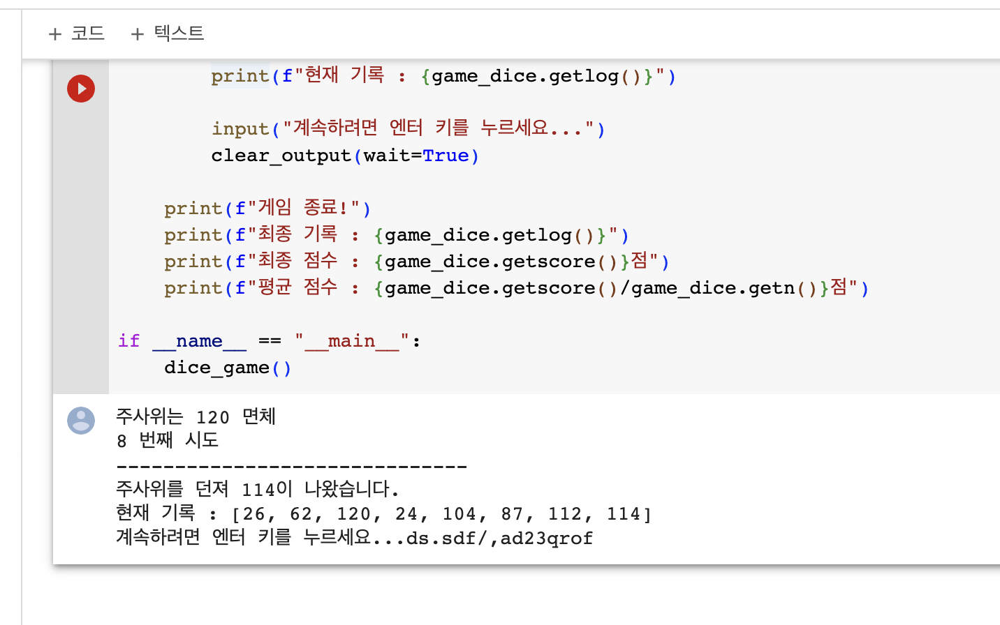

# AIFFEL Socar Campus Code Peer Review Template
- 코더 : 정영진
- 리뷰어 : [이동원](https://github.com/Cellularhacker)


# PRT(PeerReviewTemplate)
각 항목을 스스로 확인하고 토의하여 작성한 코드에 적용합니다.
- [O] 1.코드가 정상적으로 동작하고 주어진 문제를 해결했나요?
- [O] 2.주석을 보고 작성자의 코드가 이해되었나요?
  > OOP에서 가장 중요한 속성과 각 속성에 대한 setter 및 getter가 한눈에 알아보기 쉽고, 네이밍과 로직도 간결합니다.
- [O] 3.코드가 에러를 유발할 가능성이 있나요?
  > 아쉽게도 이 부분은 현재까지 우리가 배운 번위 내에서는 발생할 수 밖에 없을 것으로 생각이 되는 부분이라고 생각합니다.
  > 어떤 프로그래밍 언어에서도 동일하지만, 별다른 전처리 과정없이 없이 간단한 input을 받아서 그대로 변수에 저장하는 경우에는 특수문자에 대한 예외처리가 되지 않아 문제가 생길 가능성이 많이 높습니다.
  > 
- [O] 4.코드 작성자가 코드를 제대로 이해하고 작성했나요?
  > 클래스 내에서 각 속성을 명확하게 용도에 맞게 구분하였고, 이를 메소드를 통해 사용할 때에도 OOP의 철학에 부합하게도, 여러개의 속성을 중구난방으로 질서없이 메소드로 작성한 것이 아니라, 하나의 속성에는 하나의 메서드만 작성 하였습니다.
- [O] 5.코드가 간결한가요?
  > 주관적인 의견이 많이 포함된 생각으로는, 코드가 괜스럽게 길어지고 어렵게 구현이 될 수도 있음에도 불구하고, 최소한의 코드만 사용한 것임을 알 수 있습니다.


----

# 예시
1. 코드의 작동 방식을 주석으로 기록합니다.
2. 코드의 작동 방식에 대한 개선 방법을 주석으로 기록합니다.
3. 참고한 링크 및 ChatGPT 프롬프트 명령어가 있다면 주석으로 남겨주세요.


# 참고 링크 및 코드 개선
```python
# 코드 리뷰 시 참고한 링크가 있다면 링크와 간략한 설명을 첨부합니다.
# 코드 리뷰를 통해 개선한 코드가 있다면 코드와 간략한 설명을 첨부합니다.
```
